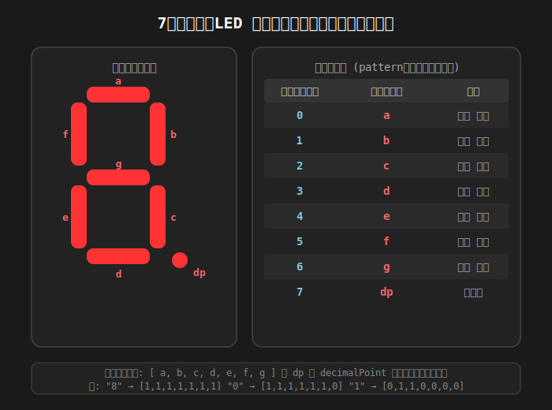

## ハンドシェイク仕様

## コマンド概要

### レトロCPUボード -> 制御・I/Oボード

| コマンド種類     | 内容                                     |
| :--------------- | :--------------------------------------- |
| CPU状態通知      | CPUレジスタなどの状態を通知する          |
| モード設定       | モニターモード/フリーモード              |
| 16進キー入力取得 | キー入力状態を取得（フリーモード時）     |
| PCキー入力取得   | PCのキー入力を中継してキー入力状態を取得 |
| LED表示依頼      | LED表示を指示（フリーモード時）          |
| BEEP音           | BEEP音を鳴らす                           |
| タイマー設定     | タイマー割り込み設定                     |
|                  | 　　　                                   |

#### CPU状態通知

| 位置 | 方向 | 値H  | 値L  | 説明     |
| :--: | :--: | :--- | :--- | :------- |
|  00  |  ->  | 10   | -    | コマンド |
|  01  |  ->  | R0   | R0   |          |
|  03  |  ->  | R1   | R1   |          |
|  05  |  ->  | R2   | R2   |          |
|  07  |  ->  | R3   | R3   |          |
|  09  |  ->  | R4   | R4   |          |
|  0B  |  ->  | SP   | SP   |          |
|  0E  |  ->  | STR  | STR  |          |
|  11  |  ->  | IC   | IC   |          |
|  13  |  ->  | CSBR | CSBR |          |
|  15  |  ->  | SSBR | SSBR |          |
|  17  |  ->  | TSR0 | TSR0 |          |
|  19  |  ->  | TSR1 | TSR1 |          |
|  1B  |  ->  | OSR0 | OSR0 |          |
|  1D  |  ->  | OSR1 | OSR1 |          |
|  1E  |  ->  | OSR2 | OSR2 |          |
|  21  |  ->  | NPP  | 0    |          |
|  23  |  ->  | 0    | IISR |          |
|  25  |  ->  | 0    | SBRB |          |
|  27  |  ->  | ICB  | ICB  |          |
|  29  |  <-  | 00　 | -    | OK       |
|  29  |  <-  | 01　 | -    | NG       |
|      |      | 　   |      |          |

#### モード設定

| 位置 | 方向 | 値H  | 値L | 説明                |
| :--: | :--: | :--- | :-- | :------------------ |
|  00  |  ->  | 11   | -   | コマンド            |
|  01  |  ->  | 値   | -   | 0:モニター 1:フリー |
|  02  |  <-  | 00　 | -   | OK                  |
|  02  |  <-  | 01　 | -   | NG                  |
|      |      | 　   |     |                     |

#### 16進キー入力取得

モードがフリーモードのとき使用可

| 位置 | 方向 | 値H          | 値L | 説明                     |
| :--: | :--: | :----------- | :-- | :----------------------- |
|  00  |  ->  | 14           | -   | コマンド                 |
|  01  |  <-  | 列0 キー値　 | -   | 8BitでキーのON/OFFを表す |
|  02  |  <-  | 列1 キー値　 | -   | 8BitでキーのON/OFFを表す |
|  03  |  <-  | 列2 キー値　 | -   | 8BitでキーのON/OFFを表す |
|  04  |  <-  | 列3 キー値　 | -   | 8BitでキーのON/OFFを表す |
|  05  |  <-  | 列4 キー値　 | -   | 8BitでキーのON/OFFを表す |
|  06  |  <-  | 列5 キー値　 | -   | 8BitでキーのON/OFFを表す |
|  07  |  <-  | 列6 キー値　 | -   | 8BitでキーのON/OFFを表す |
|  08  |  <-  | 列7 キー値　 | -   | 8BitでキーのON/OFFを表す |
|  09  |  <-  | 00　         | -   | OK                       |
|  09  |  <-  | 01　         | -   | NG モードエラー          |
|  09  |  <-  | 02　         | -   | NG その他エラー          |
|      |      | 　           |     |                          |

#### PCキー入力取得

キーコード表 
https://hspnext.sakura.ne.jp/keycode/keycode.html

| 位置 | 方向 | 値H        | 値L | 説明           |
| :--: | :--: | :--------- | :-- | :------------- |
|  00  |  ->  | 15         | -   | コマンド       |
|  01  |  <-  | ASCII値　  | -   | ASCIIコード値  |
|  02  |  <-  | コード値　 | -   | キーコード値　 |
|  03  |  <-  | 00　       | -   | OK             |
|  03  |  <-  | 01　       | -   | NG             |
|      |      | 　         |     |                |

#### LED表示依頼

モードがフリーモードのとき使用可
番号は左から 0～9 まで
 
7セグメントLEDの配置 
ビット位置 [0, 1, 2, 3, 4, 5, 6, 7] 
点灯位置 [a, b, c, d, e, f, g, dp] 

| 位置 | 方向 | 値H  | 値L | 説明               |
| :--: | :--: | :--- | :-- | :----------------- |
|  00  |  ->  | 16   | -   | コマンド           |
|  01  |  ->  | 8Bit | -   | 7セグメントLED 0番 |
|  02  |  ->  | 8Bit | -   | 7セグメントLED 1番 |
|  03  |  ->  | 8Bit | -   | 7セグメントLED 2番 |
|  04  |  ->  | 8Bit | -   | 7セグメントLED 3番 |
|  05  |  ->  | 8Bit | -   | 7セグメントLED 4番 |
|  06  |  ->  | 8Bit | -   | 7セグメントLED 5番 |
|  07  |  ->  | 8Bit | -   | 7セグメントLED 6番 |
|  08  |  ->  | 8Bit | -   | 7セグメントLED 7番 |
|  09  |  ->  | 8Bit | -   | 7セグメントLED 8番 |
|  0A  |  ->  | 8Bit | -   | 7セグメントLED 9番 |
|  0B  |  ->  | 8Bit | -   | 砲弾LED 0～7番     |
|  0C  |  ->  | 8Bit | -   | 砲弾LED 8～F番     |
|  0D  |  <-  | 00　 | -   | OK                 |
|  0D  |  <-  | 01　 | -   | NG モードエラー    |
|  0D  |  <-  | 02　 | -   | NG その他エラー    |
|      |      | 　   |     |                    |

#### BEEP音

モニターモードはBEEPは使わないのでモード関係なく使える

| 位置 | 方向 | 値H     | 値L     | 説明                                |
| :--: | :--: | :------ | :------ | :---------------------------------- |
|  00  |  ->  | 18      | -       | コマンド                            |
|  01  |  ->  | 周波数H | 周波数L | 周波数を16ビットで指定(0で停止)     |
|  02  |  ->  | 長さH   | 長さL   | BEEP音の長さをミリ秒で指定(0で無限) |
|  03  |  <-  | 00　    | -       | OK                                  |
|  03  |  <-  | 01　    | -       | NG                                  |
|      |      | 　      |         |                                     |

#### タイマー設定

タイマー割り込みの周期を設定する

| 位置 | 方向 | 値H         | 値L         | 説明                              |
| :--: | :--: | :---------- | :---------- | :-------------------------------- |
|  00  |  ->  | 19          | -           | コマンド                          |
|  01  |  ->  | タイマー値H | タイマー値L | タイマーを16ビットで指定(0で停止) |
|  02  |  ->  | 回数H       | 回数L       | タイマー割り込み回数(0で無限)     |
|  03  |  <-  | 00　        | -           | OK                                |
|  03  |  <-  | 01　        | -           | NG                                |
|      |      | 　          |             |                                   |

### レトロCPUボード <- 制御・I/Oボード

| コマンド種類          | 内容                                       |
| :-------------------- | :----------------------------------------- |
| メモリ/IOブレイク設定 | メモリ/IOへのブレイクを設定する            |
| 命令ブレイク設定      | 命令ブレイクを設定する                     |
| 状態取得              | CPUレジスタなどの状態を通知取得する        |
| 実行指示              | アドレスを渡して実行する                   |
| メモリ読み出し        | アドレスとバイト数を渡して読み込む         |
| メモリ書き込み        | アドレスとバイト数、データを渡して書き込む |
| IO読み出し            | アドレスとバイト数を渡して読み込む         |
| IO書き込み            | アドレスとバイト数、データを渡して書き込む |
|                       | 　　　                                     |

#### メモリ/IOブレイク設定

IOブレイク時、ブレイク条件の指定は無効となる

| 位置 | 方向 | 値H                          | 値L           | 説明                            |
| :--: | :--: | :--------------------------- | :------------ | :------------------------------ |
|  00  |  <-  | 40                           | -             | コマンド                        |
|  01  |  <-  | 設定番号                     | -             | ブレイク設定番号(0-3)           |
|  02  |  <-  | Bit0 0:MEM 1:IO              | -             | 0:メモリブレイク 1:IOブレイク   |
|  02  |  <-  | Bit1 0:READ 1:WRITE          | -             | 0:READブレイク 1:WRITEブレイク  |
|  02  |  <-  | Bit2-4 000:= 001:<>          | -             | ブレイク条件                    |
|  02  |  <-  | Bit2-4 010:>= 011:<=         | -             | ブレイク条件                    |
|  02  |  <-  | Bit2-4 100:AND(ビットマスク) | -             | ANDした結果 0以外の時にブレイク |
|  03  |  <-  | 0                            | アドレス16-23 | ブレイクアドレス                |
|  05  |  <-  | アドレス8-15                 | アドレス0-7   |                                 |
|  07  |  <-  | データ8-15                   | データ0-7     |                                 |
|  09  |  ->  | 00　                         | -             | OK                              |
|  09  |  ->  | 01　                         | -             | NG                              |
|      |      | 　                           |               |                                 |

#### メモリ/IOブレイク解除

| 位置 | 方向 | 値H      | 値L | 説明                  |
| :--: | :--: | :------- | :-- | :-------------------- |
|  00  |  <-  | 41       | -   | コマンド              |
|  01  |  <-  | 設定番号 | -   | ブレイク設定番号(0-3) |
|  02  |  ->  | 00　     | -   | OK                    |
|  02  |  ->  | 01　     | -   | NG                    |
|      |      | 　       |     |                       |

#### 命令ブレイク設定

| 位置 | 方向 | 値H          | 値L           | 説明                  |
| :--: | :--: | :----------- | :------------ | :-------------------- |
|  00  |  <-  | 42           | -             | コマンド              |
|  01  |  <-  | 設定番号     | -             | ブレイク設定番号(0-7) |
|  02  |  <-  | 0            | アドレス16-23 | ブレイクアドレス      |
|  04  |  <-  | アドレス8-15 | アドレス0-7   |                       |
|  06  |  ->  | 00　         | -             | OK                    |
|  06  |  ->  | 01　         | -             | NG                    |
|      |      | 　           |               |                       |

#### 命令ブレイク解除

| 位置 | 方向 | 値H      | 値L | 説明                  |
| :--: | :--: | :------- | :-- | :-------------------- |
|  00  |  <-  | 43       | -   | コマンド              |
|  01  |  <-  | 設定番号 | -   | ブレイク設定番号(0-7) |
|  02  |  ->  | 00　     | -   | OK                    |
|  02  |  ->  | 01　     | -   | NG                    |
|      |      | 　       |     |                       |
